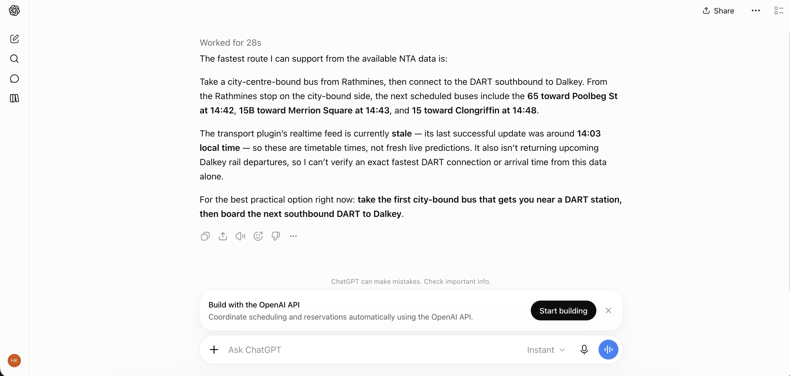

# Honest Live Transport Ireland

An AI transport assistant prototype for Ireland. It helps people explore public
transport options using the National Transport Authority’s timetable and
realtime data, while showing when an answer is based on a schedule, a fresh live
observation, or incomplete data.



*Prototype response from testing. It flags that realtime data is stale and that
the DART connection could not be verified. The suggested connection is
illustrative, not a confirmed door-to-door itinerary.*

## What it can do

- Search stops across NTA bus, Irish Rail, and Luas timetable services.
- Return upcoming scheduled departures, with optional mode and operator filters.
- Include realtime evidence when a fresh feed observation matches a scheduled
  trip; otherwise label results `scheduled-only` and report feed freshness.

The current prototype focuses on finding stops and departures. It does not yet
calculate verified multi-leg journeys or fares, and it does not include Dublin
Bikes. Coverage depends on the data available for the requested stop and service.

## Try the demo

The static timetable can be loaded without an API key. Python 3.11 or newer is
required.

```sh
python3 -m venv .venv
.venv/bin/python -m pip install -r requirements.txt
.venv/bin/python gtfs_loader.py
```

Start the MCP server:

```sh
.venv/bin/python mcp_server.py
```

It serves Streamable HTTP MCP at `http://127.0.0.1:8000/mcp`. To add live
updates, configure the NTA subscription tokens and start the realtime poller as
described in [POLLER.md](POLLER.md). The poller and MCP server use the same
database; each process can use `TRANSPORT_DB_PATH` to select it.

Example questions for an MCP-connected assistant:

- “Find Dublin Heuston and show me the next three rail departures.”
- “Find bus stops near Rathmines and show the serving operators.”
- “Are these departures based on fresh realtime data or the timetable?”

For a local LLM client, connect to the MCP endpoint above. ChatGPT’s web app
needs a remote connection path for a local server; see the [Secure MCP Tunnel
guide](https://developers.openai.com/api/docs/guides/secure-mcp-tunnels).

## Data and limitations

The static timetable is the national NTA GTFS feed. Realtime data comes from
the configured NTA GTFS-Realtime endpoints and requires subscription keys.
Realtime may be delayed, unavailable, or stale; in those cases the assistant
should present timetable times rather than call them live predictions. A trip
missing from a feed is not proof that it did not run.

The NTA feed is attributed under [CC BY 4.0](https://creativecommons.org/licenses/by/4.0/).
See [DATABASE.md](DATABASE.md) for the static feed source and refresh details,
and [POLLER.md](POLLER.md) for realtime setup and data checks.
